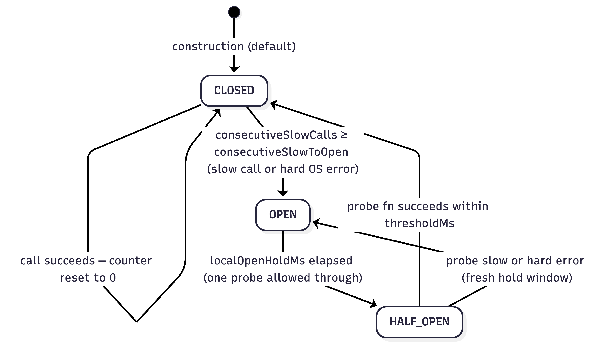
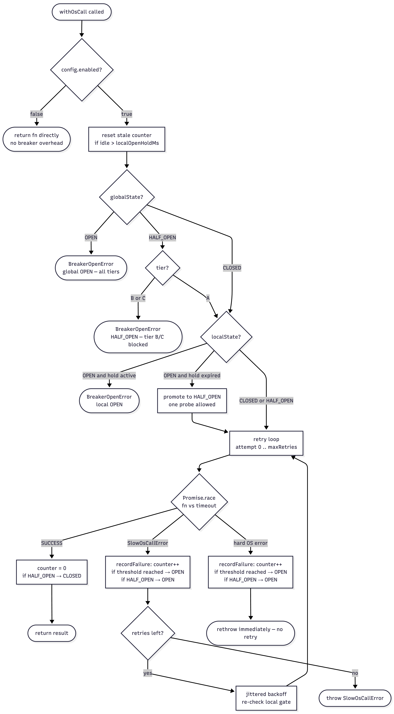

# BreakerClient — Two-Layer Circuit Breaker Design

## Overview

`libs/OSClient/lib/breakerClient.ts` implements a two-layer circuit breaker that wraps every OpenSearch call made by the Get Lambda functions.

- **Layer 1 — Global (DDB-driven):** shared fleet posture controlled by CloudWatch alarms.
- **Layer 2 — Local (observation-driven):** per-container fast-fail based on this container's observed OS response times.

---

## Why two layers?

CloudWatch alarm evaluation takes ~60 s minimum. During that window every Lambda container continues sending full traffic to a degrading OpenSearch cluster. The local layer trips within seconds of observing N consecutive slow calls, protecting users and reducing retry pressure on OS before the global posture arrives.

The local layer is **per-container** — it does not coordinate across the Lambda fleet. Fleet-wide protection is exclusively the global layer's job. The local layer protects users routed to _this_ container during the degradation window.

---

## Architecture

```text
Layer 1 — Global (DDB-driven)
  globalState: 'CLOSED' | 'OPEN' | 'HALF_OPEN'    ← reads DDB `state` field
  Source:    DDB BREAKER#GLOBAL / STATE#CURRENT
  Written:   PostCloudWatchController (CloudWatch alarm events + scheduled tick)
  Read:      cold start only — BreakerClient.init() reads DDB once and caches in instance memory
  Cleared:   operator / tick-driven recovery → PostCloudWatchController writes state='CLOSED'
  Semantics: hard gate (OPEN) / tier-aware gate (HALF_OPEN); stale for container lifetime (acceptable)

Layer 2 — Local (observation-driven)
  localState: 'CLOSED' | 'OPEN' | 'HALF_OPEN'
  Source:    this container's observed OS response times
  Written:   never to DDB — pure in-memory, scoped to this BreakerClient instance
  Cleared:   auto-recovery after localOpenHoldMs (config or BREAKER_LOCAL_OPEN_HOLD_MS env var)
  Semantics: soft gate — auto-recovers, fills the ~60s CloudWatch evaluation gap
```

---

## Service tiers and global HALF_OPEN behaviour

Each service registers with a **tier** (`A`, `B`, or `C`) when constructing its `BreakerClient`. The tier
drives how the global `HALF_OPEN` posture is handled (see `docs/resilience/service-tiers.mdx`):

| Global posture | Tier A                                 | Tier B | Tier C |
| -------------- | -------------------------------------- | ------ | ------ |
| `CLOSED`       | allow                                  | allow  | allow  |
| `OPEN`         | block                                  | block  | block  |
| `HALF_OPEN`    | **allow** (serve with optional limits) | block  | block  |

Tier A represents the core user journey and is allowed to serve during recovery so the lobby stays
functional. Tiers B and C are shed until the global posture returns to `CLOSED`.

---

## State transitions

### Local breaker state machine



### Transition rules

| From        | Trigger                                         | To                                |
| ----------- | ----------------------------------------------- | --------------------------------- |
| `CLOSED`    | `consecutiveSlowCalls >= consecutiveSlowToOpen` | `OPEN`                            |
| `OPEN`      | `Date.now() >= localOpenUntilMs`                | `HALF_OPEN` (one probe allowed)   |
| `HALF_OPEN` | probe fn resolves within threshold              | `CLOSED`                          |
| `HALF_OPEN` | probe fn slow or hard error                     | `OPEN` (fresh `localOpenUntilMs`) |

---

## Stale counter fix (freeze/thaw safety)

Lambda containers are frozen between invocations and thawed on demand. A `consecutiveSlowCalls` counter accumulated during an incident may be stale after the container thaws — OS may have fully recovered in the interim.

On entry to `withOsCall`, before any gating:

```typescript
if (this.consecutiveSlowCalls > 0 && Date.now() - this.lastSlowCallAt > localOpenHoldMs) {
    this.consecutiveSlowCalls = 0;
}
```

Using `localOpenHoldMs` as the staleness threshold is natural: if the container has been idle longer than the hold window it would have auto-recovered anyway had it been active during that period.

---

## DDB sync strategy

The global posture is read **once on cold start** via `BreakerClient.init()` and cached in the instance for the container's lifetime. There are no background or per-invocation DDB reads.

This is the correct design for serverless:

- Lambda containers have bounded lifetimes (minutes to tens of minutes). Stale global posture from cold start is acceptable — the next cold start will re-read DDB.
- Per-invocation DDB calls add latency and cost proportional to request volume. Cold-start reads are amortised across every invocation served by that container.
- A TTL-based background sync (a previous approach) degenerates to a per-invocation DDB call on low-traffic containers where the interval always elapses between invocations.
- The local state machine fills the degradation detection gap. If OS degrades while a container is warm, the local breaker trips within seconds of observing `consecutiveSlowToOpen` consecutive failures — long before CloudWatch alarm evaluation completes.

The only gap is that a global state change written by an operator while a container is warm will not be seen by that container until its next cold start. In practice, the local breaker will have already tripped on any actively degraded container.

---

## Usage

```typescript
// Module level — one instance per Lambda / per service.
// Pass tableName and tier at construction; thresholds are optional (fall back to env vars).
const breaker = new BreakerClient({
    tableName: process.env.CB_DDB_TABLE!,
    tier: 'A', // or 'B' or 'C' depending on service tier
    thresholdMs: 2000, // optional — defaults to BREAKER_SLOW_THRESHOLD_MS ?? 2000
});

// Cold start — call once per container (fire-and-forget is fine).
// Reads global posture from DDB; fails open if DDB is unavailable.
await breaker.init();

// Hot path — wraps every OpenSearch call.
const result = await breaker.withOsCall(() => osClient.search(query));

// Inspect global posture (e.g. for Tier A to apply result limits in HALF_OPEN):
if (breaker.getGlobalState() === 'HALF_OPEN') {
    // apply reduced result set / pagination limits
}
```

---

## Call flow (single `withOsCall` invocation)



```text
0. Feature flag          — enabled === false?                    → return fn() (pure passthrough)
1. Stale counter check   — reset consecutiveSlowCalls if gap since last slow call > localOpenHoldMs
2. Layer 1 gate          — globalState OPEN?                     → throw BreakerOpenError (all tiers)
                           globalState HALF_OPEN + tier B/C?     → throw BreakerOpenError
                           globalState HALF_OPEN + tier A?       → continue (serve with optional limits)
                           globalState CLOSED?                    → continue
3. Layer 2 gate          — localState OPEN + hold not expired?   → throw BreakerOpenError
                           localState OPEN + hold expired?       → promote to HALF_OPEN (probe)
4. Retry loop (0..maxRetries):
     a. If retry: await jittered backoff delay (0..cap); re-check local gate
     b. Promise.race(fn(), timeout)
        SUCCESS → reset counter; if HALF_OPEN → CLOSED; return result
        SLOW    → increment counter; if threshold reached → OPEN; if HALF_OPEN → OPEN; continue retry
        OTHER   → increment counter; if threshold reached → OPEN; if HALF_OPEN → OPEN; rethrow (no retry)
5. All retries exhausted → throw SlowOsCallError
```

---

## Per-service configuration

All threshold fields in `BreakerServiceConfig` are optional and fall back to environment variables,
then to hardcoded defaults. This lets each Lambda tune its own values without shared env-var conflicts.
Thresholds are resolved **once in the constructor** — no repeated `??` evaluation on each hot-path call.

```typescript
interface BreakerServiceConfig {
    tableName: string; // CircuitControl DDB table name
    tier: 'A' | 'B' | 'C'; // Service tier (drives HALF_OPEN behaviour)
    enabled?: boolean; // false = pure passthrough, no DDB read. Default: true.
    // Set via BREAKER_ENABLED env var to activate without a code deploy.
    thresholdMs?: number;
    maxRetries?: number;
    initialDelayMs?: number;
    maxDelayMs?: number;
    consecutiveSlowToOpen?: number;
    localOpenHoldMs?: number;
}
```

### Feature flag — deploy without activating

`enabled: false` makes the breaker a pure passthrough: `init()` is skipped (no DDB call) and
`withOsCall` delegates to `fn()` directly. This allows deploying the tier assignment and IAM policy
before activating protection:

```yaml
# template.yaml (Tier B example)
BREAKER_SERVICE_TIER: B
BREAKER_ENABLED: 'false' # ← flip to 'true' to activate — no code change required
```

Tier B and C functions are deployed with `BREAKER_ENABLED: 'false'` by default. To activate
circuit-breaker protection for a tier, update the env var and redeploy — no code change needed.

#### Tier function mapping

| Tier               | Functions                                                                                                                                                                                                         |
| ------------------ | ----------------------------------------------------------------------------------------------------------------------------------------------------------------------------------------------------------------- |
| **A** — Core       | `GetNavigationFunction`, `GetViewFunction`, `GetGamesFunction`, `GetGameConfigFunction`, `GetGameInfoFunction`                                                                                                    |
| **B** — Important  | `GetSectionViewFunction`, `GetPersonalisedSectionGamesFunction`, `GetGameSkinConfigFunction`                                                                                                                      |
| **C** — Enrichment | `GetMiniGamesFunction`, `GetAllGamesSearchFunction`, `GetSuggestedForYouFunction`, `GetRecentlyPlayedFunction`, `GetPersonalisedExtraDataFunction`, `GetRecommendedGamesOnExitFunction`, `GetGameShuffleFunction` |

---

## Env var reference

| Variable                           | Default | Meaning                                                                                         |
| ---------------------------------- | ------- | ----------------------------------------------------------------------------------------------- |
| `BREAKER_ENABLED`                  | `true`  | Master on/off switch. Set to `'false'` to deploy tier assignment without activating protection. |
| `BREAKER_SERVICE_TIER`             | `A`     | Service tier (`A`, `B`, or `C`). Controls behaviour when global posture is `HALF_OPEN`.         |
| `BREAKER_SLOW_THRESHOLD_MS`        | `2000`  | Per-call timeout that counts as slow (ms)                                                       |
| `BREAKER_MAX_RETRIES`              | `3`     | Max within-invocation retry attempts                                                            |
| `BREAKER_INITIAL_DELAY_MS`         | `100`   | Initial exponential backoff delay (ms)                                                          |
| `BREAKER_MAX_DELAY_MS`             | `8000`  | Backoff cap (ms)                                                                                |
| `BREAKER_CONSECUTIVE_SLOW_TO_OPEN` | `3`     | Consecutive failures (slow or hard error) required to trip the local breaker                    |
| `BREAKER_LOCAL_OPEN_HOLD_MS`       | `10000` | How long to stay locally `OPEN` before `HALF_OPEN` probe (ms)                                   |

Config fields passed to `BreakerServiceConfig` override the corresponding env vars. All thresholds
are resolved once at construction time — no per-call overhead.

---

## Shared DynamoDB utilities (`libs/dynamoClient`)

The DynamoDB document client and entity builders used by the breaker live in the dedicated
`libs/dynamoClient` workspace package:

- `getDdbClient(config?)` — memoised document client, keyed by `region|endpoint` to correctly
  handle DynamoDB Local in development and cross-region deployments.
- `getEntities(client, tableName)` — returns a cached set of DynamoDB Toolbox entity builders
  (BreakerState, SignalState, BreakerHistory, AlarmEvent) for the CircuitControl table.

This package is importable by any Lambda or lib that needs direct DynamoDB access without pulling
in the full `os-client` bundle.

---

## Serverless considerations

### State is per BreakerClient instance, not shared across services

All state (`globalState`, `localState`, counters) is held as instance fields. Each Lambda that
constructs a `BreakerClient` at module level gets fully independent state. One service's slow calls
do not trip another service's local breaker, even within the same warm Lambda container.

### State is not shared across Lambda containers

Each Lambda container has independent in-memory state. A locally-open container provides no benefit to sibling containers. This is by design — fleet-wide protection is the global DDB layer's responsibility. The local layer exists to fill the CloudWatch lag gap for the specific container that observed the degradation.

### One real user pays the HALF_OPEN probe cost

In traditional circuit breakers a background health-check thread issues the probe. Lambda has no background threads between invocations — a real user request is always the probe. If the probe is slow, that user waits `thresholdMs` before the breaker re-opens. This is an inherent serverless trade-off and is acceptable given that the global layer handles sustained incidents.
