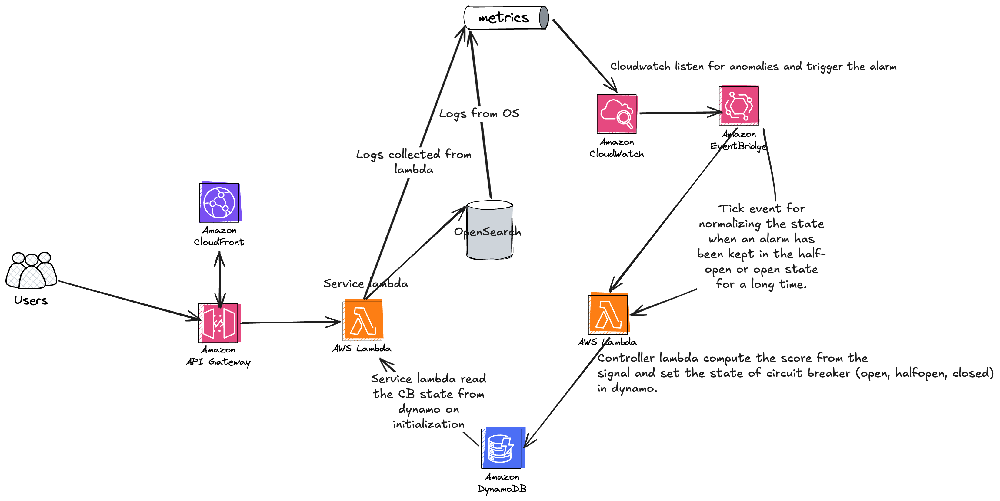
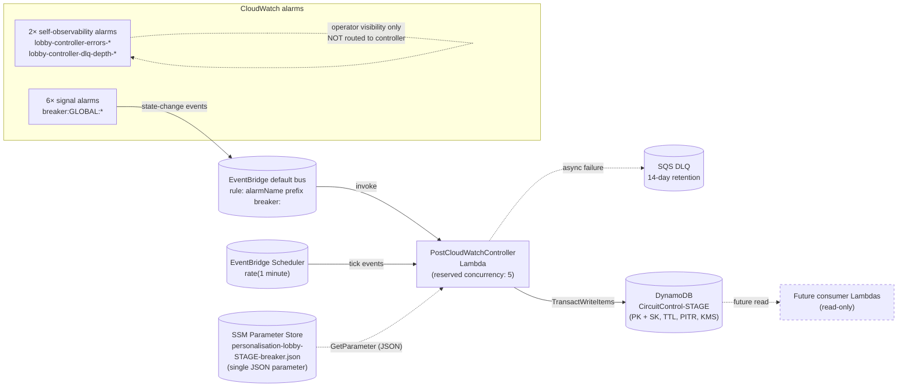

# Circuit-breaker overview

The Personalised Lobby runs a single global circuit breaker. Its job is to observe pressure on the lobby stack (OpenSearch and API Gateway) via CloudWatch alarms, decide when to shed non-critical traffic, and persist that decision somewhere downstream Lambdas can read it. This page is the entry point — it explains what each moving piece does and points at the deep-dive doc for each.

For the alarms themselves see [Circuit-breaker alarms](./circuit-breaker-alarms.mdx). For the controller's state machine see [Circuit-breaker state machine](./circuit-breaker-state-machine.mdx). For how the persisted state is structured see [Circuit-breaker data model](./circuit-breaker-data-model.mdx). For how a consumer should read it see [Consumer integration](./circuit-breaker-consumer-integration.mdx).

## Architectural diagram

## What it is

`PostCloudWatchController` is a control-plane AWS Lambda that:

1. **Consumes** CloudWatch alarm state-change events for any alarm whose name starts with `breaker:`.
2. **Aggregates** the currently-active alarms across the lobby stack into a compound severity score.
3. **Decides** the breaker's posture (CLOSED / OPEN / HALF_OPEN) based on that score plus a small state machine.
4. **Persists** the posture into a DynamoDB single-table store, with full audit history.
5. **Self-recovers** via a 1-minute scheduled tick that drives timeout-based transitions out of OPEN/HALF_OPEN.

It is **not** itself in the request path. It runs out-of-band, reacting to alarm events. The breaker state it persists is intended to be read by lobby Lambdas (the future load-shedding consumer) so they can return cached/degraded responses when the stack is under pressure. See [Service tiers](./service-tiers.mdx) for which endpoints get shed first.

## System context

Solid arrows are wired today; dashed arrows are either operator-visibility-only or planned future work.

## The setup:

### Signal alarms (6)

Six CloudWatch alarms with `AlarmName` starting `breaker:GLOBAL:` — two **critical** (any one trips the breaker on its own) and four **warning** (two or more must fire simultaneously). Critical signals are OpenSearch thread-pool rejections; warnings cover OpenSearch JVM/CPU pressure and API Gateway p99/5xx. Each alarm is a small spec — period, smoothing, missing-data policy, optional metric-math expression. See [Circuit-breaker alarms](./circuit-breaker-alarms.mdx) for the full catalogue.

### EventBridge rule

A rule on the default event bus matches `source: aws.cloudwatch` + `detail-type: CloudWatch Alarm State Change` + `detail.alarmName.prefix: "breaker:"` and routes matching events to the controller Lambda. Only alarms whose names start with `breaker:` are visible to the controller — the prefix is the **only** routing filter, which is why the self-observability alarms (`ControllerErrorsAlarm`, `ControllerDlqDepthAlarm`) are deliberately not given that prefix. See [ADR-004](./adr/004-no-breaker-prefix-on-self-obs.mdx).

### EventBridge Scheduler tick

A `rate(1 minute)` schedule (declared inline as a `ScheduleV2` event on the function in [`template.yaml`](https://gitlab.ballys.tech/excite/native/applications/personalised-lobby-ts-lambda-v3/-/blob/main/template.yaml)) invokes the controller every minute with a synthetic tick payload. The tick exists because CloudWatch alarms are **edge-triggered** — they only fire on transitions, never on sustained state — so timeout-driven transitions like OPEN → HALF_OPEN need a separate driver. See [ADR-005](./adr/005-edge-triggered-with-tick.mdx).

### Controller Lambda

A Node.js 24 Lambda (container image on stg/prod, zip on dev). On every invocation it loads settings from SSM (60 s in-process cache), reads the current breaker + signal-state items from DynamoDB with a strongly-consistent `BatchGet`, recomputes severity across the active signals, and writes back via a `TransactWriteItems` call guarded by an optimistic-concurrency `ConditionExpression`. Reserved concurrency is capped at 5 to bound contention on the single `BREAKER#GLOBAL` partition during alarm storms. See the [function source](https://gitlab.ballys.tech/excite/native/applications/personalised-lobby-ts-lambda-v3/-/blob/main/functions/PostCloudWatchController/src/index.ts) and the [state machine spec](./circuit-breaker-state-machine.mdx).

### DynamoDB table

A single-table design: one table named `CircuitControl-${StageName}`, four entity families distinguished by sort-key prefix, no secondary indexes. PITR, deletion protection, and KMS SSE are all enabled. TTL is set on history and audit items so the table size stays bounded; the live posture and signal-snapshot items have no TTL. See [Data model](./circuit-breaker-data-model.mdx) for the full schema.

### SSM Parameter Store

Six tunable knobs (`OPEN_HOLD_MS`, `HALF_OPEN_MAX_MS`, `HEALTHY_OK_EVENTS_TO_CLOSE`, `EVENT_HISTORY_TTL_SEC`, `STATE_HISTORY_TTL_SEC`, `STALE_EVENT_MS`) live as a JSON document inside a single `String` parameter named `personalisation-lobby-${StageName}-breaker.json`. The Lambda reads it via `GetParameter` on each cold start, `JSON.parse`s the value, and refreshes every 60 s via the in-process cache, so an operator's `aws ssm put-parameter --overwrite` (with the full JSON payload) propagates without a redeploy. See [ADR-001 — Configuration store decision](./configuration-store-decision.mdx).

### Async-invocation DLQ

EventBridge invokes the Lambda asynchronously. AWS Lambda retries async errors twice by default (initial attempt + 2 retries = 3 total) before discarding — see [Lambda asynchronous invocation](https://docs.aws.amazon.com/lambda/latest/dg/invocation-async.html). Without a DLQ those discarded events vanish silently. The controller's DLQ is an SQS queue with 14-day retention; depth > 0 fires `ControllerDlqDepthAlarm`. See [Runbook](./circuit-breaker-runbook.mdx).

### Self-observability alarms

Two CloudWatch alarms watch the controller itself: `ControllerErrorsAlarm` on `AWS/Lambda Errors` and `ControllerDlqDepthAlarm` on `AWS/SQS ApproximateNumberOfMessagesVisible`. Their names deliberately do **not** start with `breaker:` — naming them with that prefix would feed them back into the controller via the EventBridge rule and create a self-amplifying loop on a controller failure. See [ADR-004](./adr/004-no-breaker-prefix-on-self-obs.mdx) and the dedicated section in [Circuit-breaker alarms](./circuit-breaker-alarms.mdx#controller-self-observability-alarms).

## IAM

The controller's execution role (`PostCloudWatchControllerRole` in [`template.yaml`](https://gitlab.ballys.tech/excite/native/applications/personalised-lobby-ts-lambda-v3/-/blob/main/template.yaml)) carries the AWS-managed `AWSLambdaBasicExecutionRole` policy plus three inline policies, each scoped to a specific resource class. The least-privilege scoping means a compromised controller cannot read unrelated lobby data, write to other Lambda functions' DLQs, or read other parameters in the `/personalised-lobby/` namespace.

| Inline policy | Action(s) | Scope | Why |
|---|---|---|---|
| `CircuitControlDynamoAccess` | `dynamodb:GetItem`, `dynamodb:PutItem`, `dynamodb:BatchGetItem`, `dynamodb:TransactWriteItems` (also currently grants `dynamodb:UpdateItem` and `dynamodb:DeleteItem`, which the code does not exercise) | `CircuitControlTable.Arn` | Read/write the breaker state, signal snapshot, history, and audit rows. The unused `UpdateItem`/`DeleteItem` are template leftovers — code uses only the four operations listed first. |
| `CircuitControlDlqAccess` | `sqs:SendMessage` | `PostCloudWatchControllerDeadLetterQueue.Arn` | Required by the Lambda service to deliver failed async invocations into the DLQ. Without this the `DeadLetterQueue: { Type: SQS, TargetArn: ... }` config silently fails at runtime — the Lambda invocation appears to succeed but the failed event is dropped instead of queued. |
| `CircuitControlBreakerSettingsRead` | `ssm:GetParameter` | `arn:aws:ssm:${AWS::Region}:${AWS::AccountId}:parameter/personalisation-lobby-${StageName}-breaker.json` | Read the JSON tuning parameter at runtime via `GetParameter`. Scoped narrowly to one parameter ARN so the controller cannot enumerate or read any other parameters in the account (e.g. OpenSearch credentials under `/personalised-lobby/${StageName}/`). |
| `AWSLambdaBasicExecutionRole` (managed) | `logs:CreateLogStream`, `logs:PutLogEvents` | The function's log group | Standard Lambda logging. |

The EventBridge rule and Scheduler invocations are authorised separately via two `AWS::Lambda::Permission` resources (`PostCloudWatchControllerFunctionEventBridgePermission` and `PostCloudWatchControllerFunctionSchedulerPermission`, [template.yaml](https://gitlab.ballys.tech/excite/native/applications/personalised-lobby-ts-lambda-v3/-/blob/main/template.yaml)) that grant `lambda:InvokeFunction` to `events.amazonaws.com` and `scheduler.amazonaws.com` principals respectively. These are the inverse direction — they let the AWS service invoke the function, rather than letting the function call AWS services.

## Reading order

For someone new to this section:

1. **This page** — what each piece is.
2. [Circuit-breaker state machine](./circuit-breaker-state-machine.mdx) — the formal CLOSED ⇄ OPEN ⇄ HALF_OPEN spec.
3. [Circuit-breaker alarms](./circuit-breaker-alarms.mdx) — what each alarm measures, why it's tuned the way it is.
4. [Circuit-breaker behaviour](./circuit-breaker-behaviour.mdx) — scenario walk-throughs that trace alarms through the state machine.
5. [Circuit-breaker data model](./circuit-breaker-data-model.mdx) — what gets persisted and why.
6. [Consumer integration](./circuit-breaker-consumer-integration.mdx) — how a future Lambda will read this state to shed traffic.
7. [Consistency and concurrency](./consistency-and-concurrency.mdx) — how the controller stays correct under racing alarm events.
8. [Runbook](./circuit-breaker-runbook.mdx) — operator triage when something is on fire.
9. [ADR index](./adr/index.mdx) — the irreversible-or-load-bearing decisions, written down so you can skip the archaeology.
10. [Glossary](./glossary.mdx) — every term defined in one place.

## Industry context

This is a control-plane circuit breaker, not an in-process one. The classical references are:

- [Martin Fowler — Circuit Breaker](https://martinfowler.com/bliki/CircuitBreaker.html) — the canonical pattern write-up; useful for the CLOSED/OPEN/HALF_OPEN vocabulary even though the persistence is different.
- [Resilience4j — CircuitBreaker](https://resilience4j.readme.io/docs/circuitbreaker) — modern in-process implementation with state-machine semantics very close to ours.
- [Netflix Hystrix — How it works](https://github.com/Netflix/Hystrix/wiki/How-it-Works) — historical reference, retired but still informative on metric-driven tripping.

Where we differ from in-process breakers: the trip decision is driven by **CloudWatch alarms**, not by per-call success/failure counts; the state is **persisted in DynamoDB** so a fleet of Lambdas observe the same posture; and recovery is driven by a **scheduled tick**, not by an in-flight probe attempt. See [ADR-005](./adr/005-edge-triggered-with-tick.mdx) for why.
