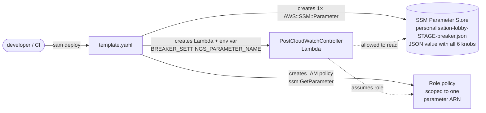
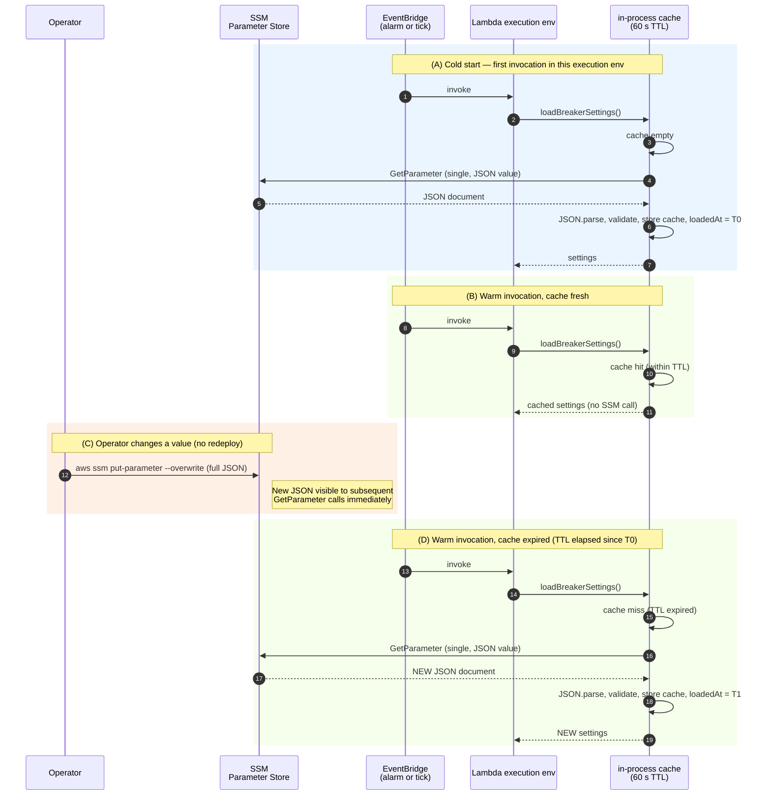

# Configuration store: how we decided

The `PostCloudWatchController` Lambda has six tunable knobs that govern breaker timing and retention (`openHoldMs`, `halfOpenMaxMs`, `healthyOkEventsToClose`, `eventHistoryTtlSec`, `stateHistoryTtlSec`, `staleEventMs`).
They began life as a hardcoded `BreakerSettings` const in `functions/PostCloudWatchController/src/config.ts`. This page captures the decision to move them to AWS Systems Manager Parameter Store, and the alternatives we explicitly considered and rejected.

The aim is operator-tunable settings that take effect **without a redeploy**, which is meaningful for a circuit-breaker controller specifically: during an incident an operator may want to widen `openHoldMs` to give a flapping backend more recovery time, and waiting for a SAM build + deploy is the wrong pace.

## What we chose

**SSM Parameter Store fetched via the AWS SDK at runtime, with a 60-second in-process TTL cache, and per-setting env-var overrides.**

- One `AWS::SSM::Parameter` per stage at `personalisation-lobby-${StageName}-breaker.json`, whose `Value` is a JSON document containing every tuning knob (`{ "OPEN_HOLD_MS": 60000, "HALF_OPEN_MAX_MS": 120000, ... }`). UPPER_SNAKE_CASE keys match the externally-provisioned shape used by stg/prod terraform.
- The Lambda calls `GetParameter` (single) once per cold start, then again after 60 s, and `JSON.parse`s the value in-process.
- The function's IAM role gets `ssm:GetParameter` scoped narrowly to that single parameter ARN.
- Per-setting env vars (`BREAKER_OPEN_HOLD_MS`, etc.) take precedence over SSM. Tests use these to skip SSM entirely; deploys can use them to pin a single value without touching SSM.
- Loader fails loud on any error (missing parameter, malformed JSON, missing/non-numeric field, SSM throttle, missing parameter-name env var). No silent fallback to defaults.

The propagation delay for an operator's `aws ssm put-parameter` is **bounded by the TTL** — at most 60 s on warm containers, immediate on cold starts. Lambda's natural container recycling ("every few hours" per AWS docs) makes the warm-container worst case effectively shorter in practice.

See [`functions/PostCloudWatchController/src/settings.ts`](https://github.com/) for the loader and [`functions/PostCloudWatchController/template.yaml`] for the parameter resource and IAM.

## What we considered

Three options were on the table. The full pricing and operational properties were verified against the AWS docs at the time of writing (April 2026).

### Option A — AWS AppConfig with the AppConfig Agent Lambda Extension

The textbook AWS pattern for "dynamic operational/feature configuration that must change without redeploy."

**Wins**

- **Validators**. AppConfig can run a JSON Schema or a Lambda validator against a new value before accepting the deployment. We could not, for example, accidentally `start-deployment` an `openHoldMs` of `-1`.
- **Auto-rollback on CloudWatch alarm.** A deployment can be wired to monitor `ControllerErrorsAlarm` (or any other alarm). If it fires during the bake window, AppConfig automatically reverts the change. For a controller whose entire job is reacting to alarms, this pairing is unusually clean.
- **Gradual rollout.** Deploy to 10 % of invocations first, bake for 5 minutes, then proceed.
- **Lambda Extension caches locally.** Code calls `http://localhost:2772/...`; the agent handles polling and TTL.

**Losses for our case**

- **Container-image stg/prod packaging.** Our Lambda runs as a container image in stg/prod and as zip-with-layers only in dev. The AppConfig Agent extension ships as a Lambda layer; using it from a container image requires fetching the layer zip ahead of build, `COPY`ing it into the image, `unzip`ing into `/opt`, and matching the architecture (arm64/amd64). That's a real Dockerfile change and a divergent install path between dev and stg/prod.
- **Cost.** $0.0000002 per configuration request, $0.0008 per *changed* configuration received. For this controller's traffic that's pennies per month — but it is non-zero, in contrast to Parameter Store standard tier which is free.
- **Operational lift.** New service, new mental model (Application → Environment → ConfigurationProfile → DeploymentStrategy → Deployment), new IAM, new agent layer to keep current.

**Verdict**: textbook fit, but the container-image install friction and the operational onboarding are not yet justified by the use case. The settings change rarely enough that validation + rollback are nice-to-have, not required.
**If the need ever arises could migrate to AppConfig** as the loader's surface in `settings.ts` is kept small and replaceable to make that swap easier.

### Option B — AWS Parameters and Secrets Lambda Extension (with Parameter Store)

A lighter middle ground: same Parameter Store backend, but use the AWS-suggested extension layer to handle caching and polling automatically. Code calls `http://localhost:2773/...` instead of importing the SSM SDK.

**Wins**

- AWS-suggested pattern, less custom code than option C.
- Built-in TTL cache, no custom cache logic to maintain.

**Losses for our case**

- **Same container-image install friction as AppConfig.** Layer needs to be installed via Dockerfile in stg/prod.
- **No validation, no rollback, no rollout strategies.** All the AppConfig wins are absent — it's just "Parameter Store with a localhost cache." For that, the SDK + 30 lines of cache code achieves the same thing across both packaging modes uniformly.

**Verdict**: pays the container-image install cost without any of the AppConfig safety upside. Strictly dominated by either A (more features) or C (less complexity).

### Option C — SDK + module cache with TTL - chosen

Lambda calls SSM directly via `@aws-sdk/client-ssm`, caches the result in a module-level variable with a 60 s TTL.

**Wins**

- **One code path across zip-dev and image-stg/prod.** No Dockerfile changes, no layer install, no architecture matching.
- **Free.** Parameter Store standard tier is "No additional charge" for both storage and API interactions at standard throughput. We are nowhere near the higher-throughput threshold that begins billing.
- **Small surface.** ~150 lines of TypeScript in `src/settings.ts`, fully tested. Easy to swap to AppConfig later without callers noticing — `loadBreakerSettings()` shape is stable.
- **Env-var overrides come for free.** Tests bypass SSM cleanly, and deploy-time pins are trivial.

**Losses**

- No validation gate. A bad `aws ssm put-parameter` will be picked up within 60 s.
- No automatic rollback. We rely on `ControllerErrorsAlarm` + DLQ depth alarm to surface bad state, then an operator reverts manually with another `put-parameter`.

**Verdict**: pragmatic now, and is what fits our case the most. We can easily migrate to other options later if we see the need.

## Pricing

[systems-manager pricing](https://aws.amazon.com/systems-manager/pricing/) at the time of writing:

| | Storage | API interactions | Free tier |
|---|---|---|---|
| **Parameter Store, standard tier, standard throughput** | "No additional charge" | "No additional charge" | n/a |
| **Parameter Store, standard tier, higher throughput** | "No additional charge" | "$0.05 per 10,000 Parameter Store API interactions" | n/a |
| **Parameter Store, advanced tier** | "$0.05 per advanced parameter per month" | (same as standard at higher throughput) | n/a |
| **AppConfig** | n/a | "$0.0000002 per configuration request" + "$0.0008 per configuration received" (only on actual changes) | None |

For this controller's volume (~1 invocation/min, 1 SSM call per warm container per minute) we are orders of magnitude below the higher-throughput threshold, so option C costs **$0/month**. Option A (AppConfig) would cost **~$0.01/month**. Both negligible — the deciding factors are operational, not financial.

## Container-image AppConfig procedure (recorded for if we decide to migrate)

The procedure for adding the AppConfig Agent extension to a container-image Lambda is documented at [docs.aws.amazon.com/appconfig/latest/userguide/appconfig-integration-lambda-extensions-container-image.html](https://docs.aws.amazon.com/appconfig/latest/userguide/appconfig-integration-lambda-extensions-container-image.html). Outline:

1. Fetch the extension layer zip ahead of the Docker build:
   ```bash
   aws lambda get-layer-version-by-arn --arn <appconfig-extension-layer-arn> \
       | jq -r '.Content.Location' | xargs curl -o extension.zip
   ```
   Layer ARNs are region- and architecture-specific; pick the one matching `${LambdaArchitecture}` (currently `arm64`).
2. In the Dockerfile:
   ```dockerfile
   COPY extension.zip extension.zip
   RUN yum install -y unzip && unzip extension.zip -d /opt && rm -f extension.zip
   ```
3. Add `appconfig:GetConfiguration` and `appconfig:StartConfigurationSession` to the function role.
4. From Lambda code, call `http://localhost:2772/applications/{app}/environments/{env}/configurations/{profile}` instead of the SSM SDK.

Migration would replace the body of `loadBreakerSettings` while keeping the public shape (`async (): Promise<BreakerSettings>`) intact, so the handler doesn't change.

## Drift caveat

The SSM parameter is managed by CloudFormation in `template.yaml` (dev / playground) and by terraform out-of-band (stg / prod). For the CFN-managed case, each `sam deploy` resets the value to whatever the template declares — so an emergency `aws ssm put-parameter` made during an incident will be reverted on the next deploy unless the template is also updated.

The intended workflow during an incident is:

1. `aws ssm put-parameter --name personalisation-lobby-${StageName}-breaker.json --type String --overwrite --value '<full JSON>'` to apply the emergency value (propagates within ~60 s). Note that `--overwrite` replaces the entire document, so include every key when tuning a single value.
2. After the incident, commit the same JSON into the `Value:` field of the `BreakerSettingsJson` resource in `template.yaml` so it persists past the next deploy.

In stg/prod the parameter is provisioned out-of-band by terraform; the CFN resource would conflict on those environments, so the template is intended to be deployed without it in those targets (or with the resource gated out by a stage condition). If dev/playground also moves to terraform-managed, drop the `BreakerSettingsJson` resource and keep only the env var + IAM.

## How initialisation and propagation work

Two complementary diagrams: what `sam deploy` puts in place, and how settings flow through the controller at runtime — including how an operator's `aws ssm put-parameter` reaches a live Lambda **without a redeploy**.

### Diagram 1 — what `sam deploy` creates



CloudFormation creates three things in one stack: the single JSON parameter with its default value from `template.yaml`, the Lambda with an env var pointing at the parameter name, and a narrowly-scoped IAM policy. After the deploy, the Lambda has everything it needs to read the settings — but the in-process cache is empty until the first invocation.

### Diagram 2 — runtime data flow



### What this means in practice

- **Cold start (A)** — every new Lambda execution environment fetches the JSON document in a single SSM call, `JSON.parse`s and validates it, and seeds the cache. One SSM round-trip per cold start.
- **Cached reads (B)** — within the 60 s window, the cache serves every invocation with no network call. The vast majority of invocations on a warm container hit this path.
- **Operator change (C)** — `aws ssm put-parameter --overwrite` replaces the whole JSON document. It does not require a redeploy. SSM stores the new value immediately and any subsequent `GetParameter` returns it — no propagation delay on the SSM side. Always include every key in the JSON payload; `--overwrite` does not merge.
- **Picked up at next cache miss (D)** — the live Lambda picks up the new value the next time its 60 s cache expires (or sooner, if a cold start happens first). **Worst-case propagation: 60 s on a warm container, immediate on a cold start.**

### Multi-container caveat

Lambda runs multiple execution environments concurrently under load. Each container has its **own independent cache** with its own `loadedAt` timestamp. After an operator change, different containers will pick up the new value at slightly different moments (each capped by its own 60 s window). The propagation is therefore *eventually consistent* across the fleet within ~60 s — not atomic. This matters for very fast-changing settings; for breaker tuning knobs that change rarely, it's a non-issue.

### Env-var override (deploy-time pin)

If a `BREAKER_*` env var is set on the Lambda function in `template.yaml`, the loader uses that value and **skips the SSM batch call entirely** for that field. This is the path tests use to bypass SSM, and the lever to pin a single value at deploy time without touching SSM. Env vars don't change between invocations, so they're effectively constant for the lifetime of the deploy.

## References

Each link is annotated with what we used it to verify, so future readers can go straight to the relevant source rather than re-deriving the question from the page title.

- [AWS Lambda execution environment lifecycle](https://docs.aws.amazon.com/lambda/latest/dg/lambda-runtime-environment.html) — when Lambda reuses a warm execution environment vs cold-starts a new one, the lifetime of module-level state, and the "every few hours" terminate-and-recreate cadence. Used to bound the worst-case staleness of the 60 s in-process settings cache.
- [SSM Parameter Store — working with parameters](https://docs.aws.amazon.com/systems-manager/latest/userguide/parameter-store-working-with-parameters.html) — confirmation that `GetParameter` without a version returns the latest, and that `PutParameter` updates are immediately readable by subsequent calls. Both are load-bearing for the "no redeploy needed" property of the chosen approach.
- [Parameter Store throughput tiers](https://docs.aws.amazon.com/systems-manager/latest/userguide/parameter-store-throughput.html) — distinction between standard throughput (free) and higher throughput (opt-in, billed). Used to confirm that this controller's call volume sits comfortably in the free tier.
- [AWS Systems Manager pricing](https://aws.amazon.com/systems-manager/pricing/) — verbatim pricing for Parameter Store (storage + API interactions, both tiers) and AppConfig (configuration requests + configurations received). Source of the pricing table above.
- [What is AWS AppConfig](https://docs.aws.amazon.com/appconfig/latest/userguide/what-is-appconfig.html) — core concepts (Application, Environment, ConfigurationProfile, DeploymentStrategy), validator hooks, automatic rollback on CloudWatch alarm. Used to evaluate Option A.
- [Adding the AWS AppConfig Agent Lambda extension](https://docs.aws.amazon.com/appconfig/latest/userguide/appconfig-integration-lambda-extensions.html) — canonical Lambda-extension install procedure for zip-based functions (layer ARN flow). Used to evaluate Options A and B.
- [Using a container image to add the AWS AppConfig Agent Lambda extension](https://docs.aws.amazon.com/appconfig/latest/userguide/appconfig-integration-lambda-extensions-container-image.html) — divergent install procedure for image-based Lambdas (download zip, `COPY` into image, `unzip` into `/opt`, arch-match). Source of the migration outline above; this divergence between zip-dev and image-stg/prod packaging was a key factor in choosing Option C.
