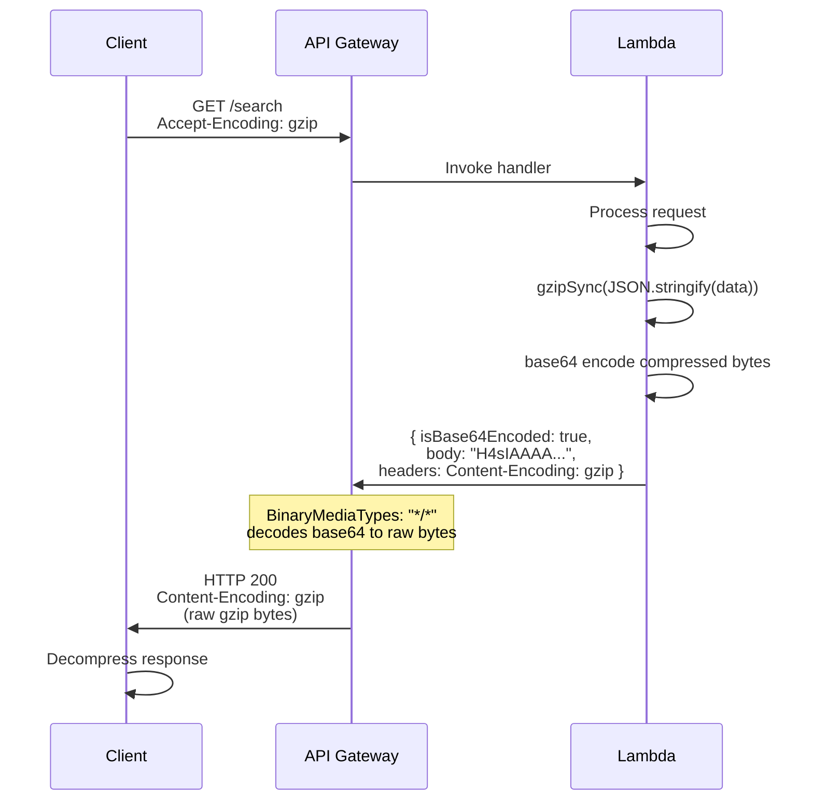

# Gzip Compression Implementation

This Lambda function always returns gzip-compressed responses to reduce payload size and improve transfer times.

## How It Works

The Lambda compresses responses using Node.js `zlib.gzipSync()` and returns them as base64-encoded binary data. API Gateway then decodes the base64 and forwards the raw gzip bytes to the client.



## Production API Gateway Configuration

**Required:** The API Gateway must have `BinaryMediaTypes` configured to handle Lambda-compressed responses.

### AWS CloudFormation / SAM

```yaml
MyApi:
    Type: AWS::Serverless::Api
    Properties:
        BinaryMediaTypes:
            - '*/*'
```

### Terraform

```hcl
resource "aws_api_gateway_rest_api" "lobby_api" {
  name = "lobby-api"

  binary_media_types = ["*/*"]
}
```

## Client Requirements

Clients calling this endpoint must:

1. **Send `Accept-Encoding` header** (recommended):

    ```
    Accept-Encoding: gzip, deflate
    ```

2. **Handle gzip responses**: Most HTTP libraries (axios, fetch, curl) automatically decompress responses when `Content-Encoding: gzip` is present.

## Response Headers

The Lambda sets these headers on compressed responses:

| Header             | Value              | Purpose                                                    |
| ------------------ | ------------------ | ---------------------------------------------------------- |
| `Content-Type`     | `application/json` | Indicates JSON payload (after decompression)               |
| `Content-Encoding` | `gzip`             | Tells client the body is gzip-compressed                   |
| `Vary`             | `Accept-Encoding`  | Indicates response varies based on client encoding support |

### Non-JSON payloads

- Set an explicit `Content-Type` (e.g., `text/plain`, `application/xml`) when using `gzipResponse` with non-JSON bodies.
- `parseCompressedBody` only JSON-parses when the content type includes `json`; otherwise it returns the raw string. If a body is labeled JSON but is not valid JSON, it will fall back to returning the raw string instead of throwing.

## Compatibility

- **Requirement**: Clients must handle `Content-Encoding: gzip` responses (most modern HTTP clients do by default).
