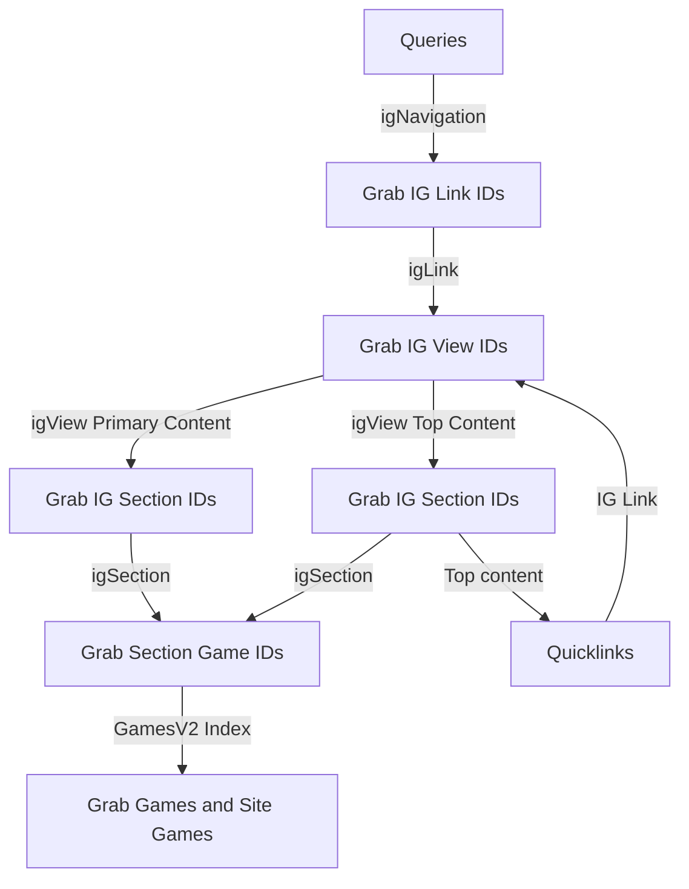

# Get-bulk-game-data Lambda Function

> Lambda to get fresh game data for ML

The lambda retrieves site visible games for a specific venture for the endpoint `/content/sitenames{sitename}/platform/{platform}/get-bulk-game-data`.
Full contract can be found [here](http://static0.psnative.pgt.gaia/personalised_lobby/personalised-lobby-v3.html#tag/BulkGameData)

## Workflow

The goal is to retrieve "user-visible games" from our sites. These are the games available on our websites and linked to other documents. To access all visible games, we begin at the "root" index and perform queries to collect games associated with active documents.

1. **Navigation Index**

    - **Grab IG Link IDs:** Initial step to collect IG link ids.
    - **Grab IG View Ids:** Prase the ig link to get the view ids

2. **View Index**

    - The view IDs lead to two types of content which hold sections:
        - **Primary Content**
        - **Top Content**

3. **Sections Index**
    - There are various sections linked to primary and top content
        - Combine section IDs from both primary and top content where we can extract a list of section game ids.
4. **Games Index**
    - **"User Visible Games":** The final set, collecting games and site game data visible to the user.



## Local development

### Add the Cloudformation template to the top level `template.toml`

Under `Resources` add:

```yml
# get-bulk-game-data
GetBulkGameDataFunction:
    Type: AWS::Serverless::Function
    Properties:
        CodeUri: ./lambdas/GetBulkGameDataFunction/ # Folder of the lambda function
        Handler: app.lambdaHandler # Adjust the handler path to dist/app.lambdaHandler
        Runtime: nodejs20.x
        Layers:
            # - !ImportValue OSClientLayerArn
            - !Ref OSClientLayer
        Environment:
            Variables:
                HOST: https://search-lobby-opsearch-oc5o7t2piau33hcu5ej3ortis4.eu-west-1.es.amazonaws.com/
                OS_USER: !Sub '{{resolve:ssm:/personalised-lobby/dev/OS_USER:2}}'
                OS_PASS: !Sub '{{resolve:ssm:/personalised-lobby/dev/OS_PASS:2}}'
                CONTENTFUL_SPACE_LOCALE: !Sub '{{resolve:ssm:/personalised-lobby/dev/CONTENTFUL_SPACE_LOCALE:1}}'
        Architectures:
            - !Ref LambdaArchitecture
        Events:
            GetBulkGameData:
                Type: Api
                Properties:
                    Path: /content/sitenames{sitename}/platform/{platform}/get-bulk-game-data
                    Method: get
                    RestApiId:
                        Ref: GetBulkGameDataAPI
    Metadata:
        BuildMethod: esbuild
        BuildProperties:
            Minify: true
            Target: es2020
            EntryPoints:
                - app.ts
            External:
                - os-client
                - /opt/nodejs/node_modules/os-client

GetBulkGameDataAPI:
    Type: AWS::Serverless::Api
    Properties:
        StageName: !Ref StageName
        OpenApiVersion: '2.0'
        EndpointConfiguration:
            Type: REGIONAL
        DefinitionBody:
            swagger: '2.0'
            info:
                title: 'API for GetBulkGameDataFunction'
            paths:
                /content/sitenames{sitename}/platform/{platform}/get-bulk-game-data:
                    get:
                        produces:
                            - 'application/json'
                        responses:
                            '200':
                                description: '200 response'
                        x-amazon-apigateway-integration:
                            uri:
                                Fn::Sub: arn:aws:apigateway:${AWS::Region}:lambda:path/2015-03-31/functions/${GetBulkGameDataFunction.Arn}/invocations
                            responses:
                                default:
                                    statusCode: '200'
                            passthroughBehavior: 'when_no_match'
                            httpMethod: 'POST'
                            type: 'aws_proxy'
```

Under `Outputs` add:

```yml
# get-bulk-game-data
GetBulkGameDataAPI:
    Description: API Gateway endpoint URL for GetBulkGameDataFunction function
    Value: !Sub 'https://${GetBulkGameDataAPI}.execute-api.${AWS::Region}.amazonaws.com/${StageName}/content/sitenames{sitename}/platform/{platform}/get-bulk-game-data'
GetBulkGameDataFunction:
    Description: GetBulkGameDataFunction Lambda Function ARN
    Value: !GetAtt GetBulkGameDataFunction.Arn
GetBulkGameDataFunctionIamRole:
    Description: Implicit IAM Role created for GetBulkGameDataFunction function
    Value: !GetAtt GetBulkGameDataFunctionRole.Arn
```

_Note: Outputs are needed for deployments to AWS. If we switch to terraform in the future, this will not be needed._

### Local invoke with sam

Neither the lambdas nor the lambda-layers need to be build locally before building with sam as `sam build` itself will take care of that.

To build the lambda locally run `sam build` from top level.

After a successful `sam-build` to invoke the lambda locally provide the function name as well as the path to the events.json triggering the lambda and the path to the env.json file for the credentials. The command is ran from top level as well.

```sh
    sam local invoke "GetBulkGameDataFunction" -e functions/GetBulkGameDataFunction/events/event.json --env-vars env.json
```
