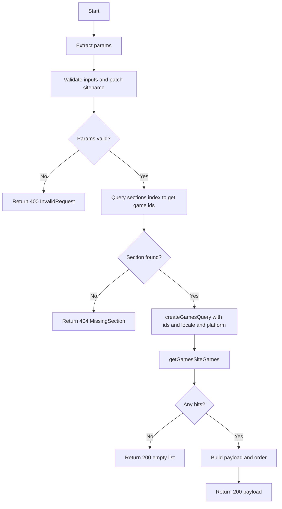
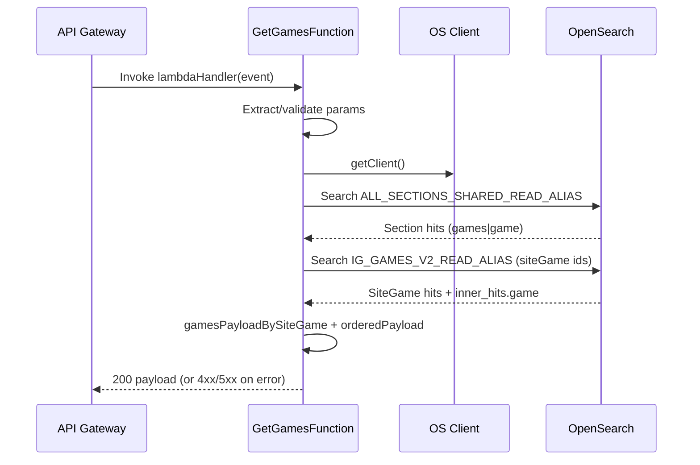

# Get-games Lambda Function

> Get games for a non-personalised section

The lambda retrieves the games for a specific **non-personalised** section on a venture for the endpoint `/sites/{sitename}/platform/{platform}/view/{viewslug}/sections/{sectionid}/sitegames`.

Personalised sections (Suggested for you / Because you played / Recently played) are served by a separate lambda — `GetPersonalisedSectionGamesFunction` (`/sitegames/personalised`). This lambda no longer accepts `memberid` and does not branch on section type.

See the API contract: [SectionGames](http://static0.psnative.pgt.gaia/personalised_lobby/personalised-lobby-v3.html#tag/SectionGames/paths/~1api~1excite~1v3~1content~1sites~1%7Bsitename%7D~1platform~1%7Bplatform%7D~1view~1%7Bviewslug%7D~1sections~1%7Bsectionid%7D~1sitegames/get)

## UML Activity Diagram



## Sequence diagram



## Error handling and status codes

This function standardises error responses. When an error is thrown inside the handler, the catch block returns:

```json
{ "code": "<ErrorCode>", "message": "<Human readable message>" }
```

### Non-200 responses

| Scenario                                                                  | Where                                          | Status | Error code              | Body                                                                |
| ------------------------------------------------------------------------- | ---------------------------------------------- | -----: | ----------------------- | ------------------------------------------------------------------- |
| Missing required params (`sitename`, `platform`, `viewslug`, `sectionid`) | `checkRequestParams`                           |    400 | `InvalidRequest`        | `{ code: InvalidRequest, message: <msg> }`                          |
| Invalid `offset` / `limit` query param                                    | `parsePaginationParam`                         |    400 | `InvalidRequest`        | `{ code: InvalidRequest, message: <msg> }`                          |
| Section not found for id/platform/env                                     | `getGamesListForSection` (sections read alias) |    404 | `MissingSection`        | `{ code: MissingSection, message: <msg> }`                          |
| No `inner_hits.game` returned for a siteGame hit                          | `validateGameHits` via `getGameHits`           |    404 | `NoGamesReturned`       | `{ code: NoGamesReturned, message: <msg> }`                         |
| OpenSearch client error (network/5xx/parse)                               | `osClient.searchWithHandling`                  |    500 | `OpenSearchClientError` | `{ code: OpenSearchClientError, message: "Internal Server Error" }` |

### 200 with empty payload

| Scenario                    | Where               | Behaviour                                                     |
| --------------------------- | ------------------- | ------------------------------------------------------------- |
| Games query returns no hits | `getGamesSiteGames` | Logs a warn and returns `[]`; Lambda responds `200` with `[]` |

## Local development

The monorepo uses Nx for builds and SAM for local invocation.

### Prerequisites

- Node.js 24, Yarn
- AWS CLI + SAM CLI
- Container runtime: Podman (preferred locally) or Docker

### One-time setup

```bash
# from repo root
yarn install

# copy environment files used by SAM (two territories supported out-of-the-box)
cp env.eu.json.example env.eu.json
cp env.na.json.example env.na.json

# optional: for container-run helper script (reads env.json)
cp env.eu.json.example env.json
```

### Build with Nx (used by SAM under the hood)

```bash
# build only this function
npx nx build get-games

# or build everything
yarn build
```

### Build the SAM project

```bash
sam build
sam build --parameter-overrides "FunctionName=GetGamesFunction"
```

### Invoke locally with SAM

```bash
# EU
sam local invoke "GetGamesFunction" -e functions/GetGamesFunction/events/event.eu.json --env-vars env.eu.json

# NA
sam local invoke "GetGamesFunction" \
  -e functions/GetGamesFunction/events/event.na.json \
  --config-env na
```

### Run a local API with SAM

```bash
sam local start-api                 # default (EU)
sam --config-env na local start-api # NA

curl "http://127.0.0.1:3000/sites/{sitename}/platform/{platform}/view/{viewslug}/sections/{sectionid}/sitegames"

# pagination
curl "http://127.0.0.1:3000/sites/{sitename}/platform/{platform}/view/{viewslug}/sections/{sectionid}/sitegames?offset=0&limit=10"
```

### Tests, lint, and formatting

```bash
npx nx test get-games
npx nx lint get-games
npx nx run get-games:format
```

## Pagination

Request-level pagination via query params:

- `offset` (optional): zero-based starting index in the section `games` list.
- `limit` (optional): max number of games to return after `offset` is applied.

Rules:

- both params are optional.
- values must be non-negative integers.
- invalid values (e.g. `-1`, `1.5`, `abc`) return `400 InvalidRequest`.

```bash
# first 10 games
curl "http://127.0.0.1:3000/sites/{sitename}/platform/{platform}/view/{viewslug}/sections/{sectionid}/sitegames?offset=0&limit=10"

# next 10 games
curl "http://127.0.0.1:3000/sites/{sitename}/platform/{platform}/view/{viewslug}/sections/{sectionid}/sitegames?offset=10&limit=10"
```
