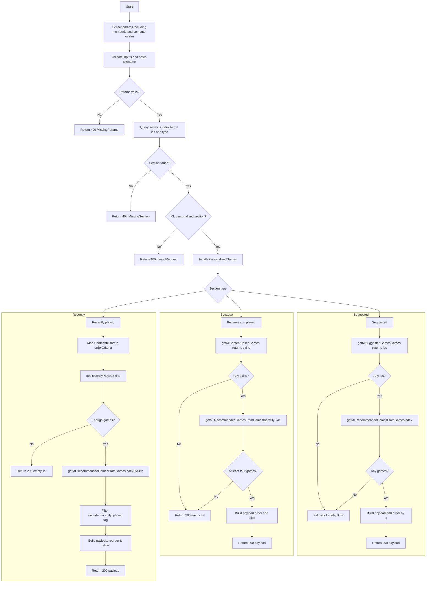
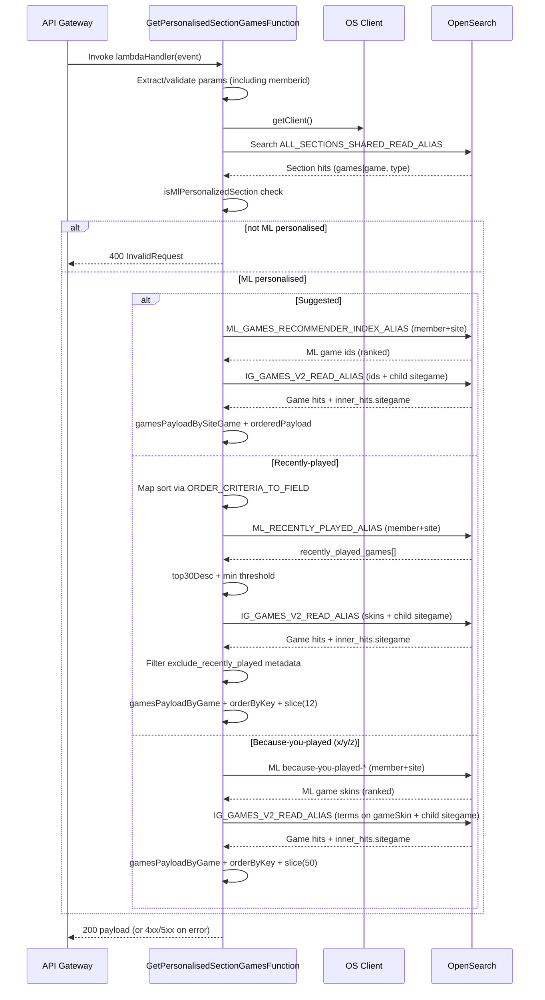

# Get-personalised-games Lambda Function (Personalised Section Games)

> Get personalised section games for a member

The lambda retrieves personalised games (ML-recommended) for a specific member and section on a venture for the endpoint `/sites/{sitename}/platform/{platform}/view/{viewslug}/sections/{sectionid}/sitegames/personalised?memberid={memberid}`

Only ML-personalised section types are supported (suggested, because-you-played, recently-played). Non-personalised section types return a 400 error.

## UML Activity Diagram



## Sequence diagram



Notes

- `getClient()` builds the OpenSearch client from environment variables but does not validate them; any misconfiguration surfaces later as the "os client error" branch when a query executes.
- `getLambdaExecutionEnvironment()` validates `EXECUTION_ENVIRONMENT` and defaults to `production` if missing/invalid.
- This lambda only handles ML-personalised section types. Non-personalised sections return 400 (InvalidRequest) via `isMlPersonalizedSection` check.
- Missing section in `ALL_SECTIONS_SHARED_READ_ALIAS` yields 404 (MissingSection).
- When ML returns no recommendations, `handleMissingMLRecommendations` falls back to the section's default game list from Contentful.
- The **recently played** branch honours Contentful sort choices by mapping the `sort`
  field from `igSimilarityBasedPersonalisedSection` to OpenSearch metrics via
  `ORDER_CRITERIA_TO_FIELD` (margin → `margin_rank`, `rtp`, `wager`, `rounds`). After enrichment it
  filters the `exclude_recently_played` metadata tag before ordering.

## Error handling and status codes

This function standardises error responses. When an error is thrown inside the handler, the catch block returns:

```json
{ "code": "<ErrorCode>", "message": "<Human readable message>" }
```

### Non-200 responses

| Scenario                                                                              | Where                                          | Status | Error code              | Body                                                                |
| ------------------------------------------------------------------------------------- | ---------------------------------------------- | -----: | ----------------------- | ------------------------------------------------------------------- |
| Missing required params (`sitename`, `platform`, `viewslug`, `sectionid`, `memberid`) | `checkRequestParams`                           |    400 | `MissingParams`         | `{ code: MissingParams, message: <msg> }`                           |
| Section type is not ML personalised                                                   | `isMlPersonalizedSection` check in handler     |    400 | `InvalidRequest`        | `{ code: InvalidRequest, message: <msg> }`                          |
| Invalid pagination params (negative, non-integer)                                     | `parsePaginationParam`                         |    400 | `InvalidRequest`        | `{ code: InvalidRequest, message: <msg> }`                          |
| Section not found for id/platform/env                                                 | `getGamesListForSection` (sections read alias) |    404 | `MissingSection`        | `{ code: MissingSection, message: <msg> }`                          |
| No `inner_hits.game` returned for a siteGame hit                                      | `validateGameHits` via `getGameHits`           |    404 | `NoGamesReturned`       | `{ code: NoGamesReturned, message: <msg> }`                         |
| OpenSearch client error (network/5xx/parse)                                           | `osClient.searchWithHandling`                  |    500 | `OpenSearchClientError` | `{ code: OpenSearchClientError, message: "Internal Server Error" }` |

Notes

- The handler catch block uses `err.statusCode || 500` so any thrown error with a status propagates; otherwise it defaults to 500.
- Error codes and messages come from the shared `os-client` error helpers.

### 200 with empty payload (in this lambda)

The personalised handler returns HTTP 200 with an empty array (no error) when no games are available.

| Scenario                                    | Where                              | Behaviour                                                                   |
| ------------------------------------------- | ---------------------------------- | --------------------------------------------------------------------------- |
| ML returns no recs or rec games not found   | ML helpers / personalised handlers | Returns `[]` from the personalised handler; Lambda responds `200` with `[]` |
| Fallback: default game list returns no hits | `getGamesSiteGames`                | Logs a warn and returns `[]`; Lambda responds `200` with `[]`               |

## Local development

The monorepo uses Nx for builds and SAM for local invocation.

### Prerequisites

- Node.js 20, Yarn
- AWS CLI + SAM CLI
- Container runtime: Podman (preferred locally) or Docker

### One-time setup

```bash
# from repo root
yarn install

# copy environment files used by SAM (two territories supported out-of-the-box)
cp env.eu.json.example env.eu.json
cp env.na.json.example env.na.json

# optional: for container-run helper script (reads env.json)
cp env.eu.json.example env.json
```

### Build with Nx (used by SAM under the hood)

You can build just this function or the whole workspace:

```bash
# build only this function
npx nx build get-personalised-section-games

# or build everything
yarn build
```

SAM’s template uses `BuildMethod: makefile` which calls `scripts/sam-nx-build.js` to place outputs in `.aws-sam/build/<FunctionName>`.

### Build the SAM project

```bash
# build all resources declared in template.yaml
sam build

# or build specific resource(s)
sam build --parameter-overrides "FunctionName=GetPersonalisedSectionGamesFunction"
```

### Invoke locally with SAM

EU (default config-env):

```bash
sam local invoke "GetPersonalisedSectionGamesFunction" -e functions/GetPersonalisedSectionGamesFunction/events/event.eu.json --env-vars env.eu.json
```

NA (uses `samconfig.toml` env overrides):

```bash
sam local invoke "GetPersonalisedSectionGamesFunction" \
  -e functions/GetPersonalisedSectionGamesFunction/events/event.na.json \
  --config-env na
```

Tip: Nx wrappers exist for convenience (ensure `sam build` ran first):

```bash
# EU
npx nx run get-personalised-section-games:sam-invoke-eu

# NA (override function name just in case)
npx nx run get-personalised-section-games:sam-invoke-na --args="--functionName=GetPersonalisedSectionGamesFunction"
```

### Run a local API with SAM

```bash
sam local start-api                 # default (EU)
# or
sam --config-env na local start-api # NA

# then call
curl "http://127.0.0.1:3000/sites/{sitename}/platform/{platform}/view/{viewslug}/sections/{sectionid}/sitegames/personalised?memberid={memberid}"

# pagination example (offset + limit)
curl "http://127.0.0.1:3000/sites/{sitename}/platform/{platform}/view/{viewslug}/sections/{sectionid}/sitegames/personalised?memberid={memberid}?offset=0&limit=10"
```

### Containerised local run (Podman/Docker)

Build an image for this function and run it in a local container:

```bash
# build image (Podman locally)
npx nx run get-personalised-section-games:docker

# run and invoke via helper (reads ./env.json)
npx nx run get-personalised-section-games:run-docker
```

The helper script `scripts/invoke-docker-lambda.js` will:

- start the container `personalised-lobby/get-personalised-section-games:latest`
- POST the example event file `functions/GetPersonalisedSectionGamesFunction/events/event.json` to the runtime
- stop and remove the container

To target NA values with the helper, replace `env.json` with NA values (or generate it from `env.na.json.example`).

### Tests, lint, and formatting

```bash
# tests (integration tests use nock)
npx nx test get-personalised-section-games

# lint just this project
npx nx lint get-personalised-section-games

# format files in this project
npx nx run get-personalised-section-games:format
```

## Future work

### Pagination

#### Implemented endpoint pagination

This lambda supports request-level pagination through query params:

- `offset` (optional): zero-based starting index in the section `games` list.
- `limit` (optional): max number of games to return after `offset` is applied.

Rules:

- both params are optional.
- values must be non-negative integers.
- invalid values (e.g. `-1`, `1.5`, `abc`) return `400 InvalidRequest`.

Examples:

```bash
# first 10 games
curl "http://127.0.0.1:3000/sites/{sitename}/platform/{platform}/view/{viewslug}/sections/{sectionid}/sitegames/personalised?memberid={memberid}?offset=0&limit=10"

# next 10 games
curl "http://127.0.0.1:3000/sites/{sitename}/platform/{platform}/view/{viewslug}/sections/{sectionid}/sitegames?offset=10&limit=10"
```

#### Basic Pagination Concept

`size`: This parameter controls how many results to return in your response.
`from`: This parameter specifies the offset from the first result you want to retrieve. This allows you to "skip" over a set number of results.

##### How to Implement Pagination

For the initial request, you might not use the from parameter, or set it to 0, and just set size to the number of results you want per page. For subsequent requests, you increment the from parameter by the size of the previous pages.

Here's how you can calculate the from parameter for pagination:

###### First Page Request

```json
{
    "from": 0,
    "size": 10,
    "query": {
        "match_all": {}
    }
}
```

###### Second Page Request

```json
{
    "from": 10, // This is size of the first page
    "size": 10,
    "query": {
        "match_all": {}
    }
}
```

###### Third Page Request

```json
{
    "from": 20, // This is size of the first page + size of the second page
    "size": 10,
    "query": {
        "match_all": {}
    }
}
```

##### Considerations

Performance: As you paginate deeper into the dataset (i.e., a very high from value), performance might degrade because OpenSearch has to count through more data to get to the offset. For very large datasets or deep pagination, consider using the "Search After" feature which is more efficient for deep pagination.

##### Search After

This method is recommended for deep pagination. It uses the last result of the previous query as a point to start the next query. This is more efficient than using from and size for large datasets.

Here’s an example using search_after:

###### Initial Request

```json
{
    "size": 10,
    "query": {
        "match_all": {}
    },
    "sort": [
        { "_id": "asc" } // Ensure results are sorted by a field that includes a tie-breaking field
    ]
}
```

###### Subsequent Request (using the last \_id from the previous batch)

```json
{
    "size": 10,
    "query": {
        "match_all": {}
    },
    "search_after": ["last_id_from_previous_batch"],
    "sort": [{ "_id": "asc" }]
}
```

###### Steps to Calculate last_id_from_previous_batch

The last_id_from_previous_batch in the context of the "search after" method in OpenSearch refers to the last sort value of the results from your previous query. This value is used as the cursor for the next set of results.

1. Perform the Initial Search: Your first search request should include a sort parameter that defines how the results are sorted. It's crucial to sort by a field that ensures a unique sequence, like a timestamp or an ID. Often, a combination of fields is used to guarantee uniqueness.

Example query:

```json
{
    "size": 10,
    "query": {
        "match_all": {}
    },
    "sort": [
        { "timestamp": "asc" },
        { "_id": "asc" } // Using _id as a secondary sort to ensure uniqueness
    ]
}
```

1. Extract the Last Sort Value: When you receive your search results, you need to look at the sort values of the last document in the result set. This is typically returned in the search hits under the \_source or directly in the sort values.

2. Use This Value in the Next Search: For your subsequent query, use these sort values in the search_after parameter to start the next query right after the last document of your previous batch.

Example for the next query:

```json
{
    "size": 10,
    "query": {
        "match_all": {}
    },
    "search_after": ["2023-06-24T15:00:00", "xy123"], // Timestamp and _id of the last document from the previous query
    "sort": [{ "timestamp": "asc" }, { "_id": "asc" }]
}
```
