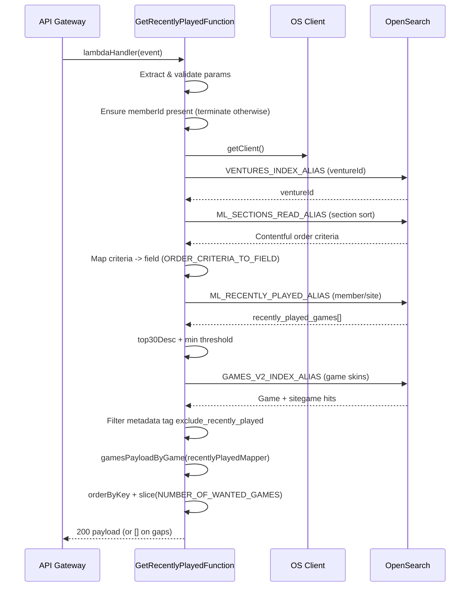

# GetRecentlyPlayed Lambda Function

> Serve personalised "recently played" game recommendations for a member on a venture

This lambda backs the `/sites/{sitename}/platform/{platform}/recently-played?memberId={memberId}`
endpoint. Requests missing `memberId` are rejected during parameter validation; the endpoint is only
available for logged-in members. When a valid call arrives the function gets the user latest game activity from Data, sorts and filters the games, enriches them with Contentful metadata, and returns
the ordered payload ready for rendering.

The API contract lives here:
[RecentlyPlayedGames](http://static0.psnative.pgt.gaia/personalised_lobby/personalised-lobby-v3.html#tag/RecentlyPlayedGames/paths/~1api~1excite~1v3~1content~1sites~1%7Bsitename%7D~1platform~1%7Bplatform%7D~1recently-played/get).

## High-level flow



### Step-by-step summary

1. **Request handling (`app.ts`)**
    - Patch venture name, validate `sitename/platform/memberid`, resolve locales and venture id.
    - Acquire the personalisation section configuration to determine the active order criteria
      (defaults to margin → `margin_rank`).
2. **ML activity (`recentlyPlayed.ts#getRecentlyPlayedSkins`)**
    - Query `ML_RECENTLY_PLAYED_ALIAS` for the `{member}_{site}` document.
    - Sort the `recently_played_games` entries via `top30Desc`. Sorting ascends for `margin_rank` and
      descends for every other metric.
    - Enforce `NUMBER_OF_MIN_GAMES` (3), cap consideration at `MAX_NUMBER_OF_GAMES` (30) and seed the
      first skin with a default fallback.
3. **Game enrichment & filtering**
    - Fetch game + sitegame documents from `GAMES_V2_INDEX_ALIAS` using
      `getMLRecommendedGamesFromGamesIndexBySkin`.
    - Drop any result whose metadata tags include the exclusion tag `exclude_recently_played`.
4. **Payload construction**
    - `createDefaultMapperPicking` selects the curated subset of fields (ids, media, jackpots, tags,
      etc.) and keeps the payload lean.
    - `orderByKey` reorders the enriched payload to follow the ML ranking and slices to
      `NUMBER_OF_WANTED_GAMES` (12).
5. **Fallback behaviour**
    - Returns `[]` when ML misses, insufficient games remain after filtering, or enrichment raises an
      exception. Logs capture the scenario via `LogCode.HandlePersonalised` and `ErrorCode` enums.

### Constants

| Constant                 | Value                     | Description                                    |
| ------------------------ | ------------------------- | ---------------------------------------------- |
| `MAX_NUMBER_OF_GAMES`    | 30                        | Maximum ML recommendations considered          |
| `NUMBER_OF_WANTED_GAMES` | 12                        | Final payload length                           |
| `NUMBER_OF_MIN_GAMES`    | 3                         | Minimum ML recommendations required to proceed |
| `RP_EXCLUSION_TAG`       | `exclude_recently_played` | Metadata tag that forces a game to be removed  |

**Sorting options** originate from the personalised section entry of type
`igSimilarityBasedPersonalisedSection` (one per venture/platform). The Contentful `sort` field drives
which metric the lambda uses:

| Contentful sort value | Indexed field | Behaviour                            | Description                                              |
| --------------------- | ------------- | ------------------------------------ | -------------------------------------------------------- |
| `margin`              | `margin_rank` | Ascending (lowest margin rank first) | The return profit to the provider per each game          |
| `rtp`                 | `rtp`         | Descending                           | Return to player (profit from each game)                 |
| `wagered_amount`      | `wager`       | Descending                           | The amount the player has wagered on each game           |
| `rounds_played`       | `rounds`      | Descending                           | The number of rounds the player has wagered on each game |

Games carrying other metadata tags stay in the payload. Automated tests verify both the exclusion
and non-exclusion cases.

## Lambda layout

```
functions/GetRecentlyPlayedFunction/
├── app.ts                         # Lambda entry point
├── lib/recentlyPlayedSection.ts   # Section configuration + order criteria mapping
├── tests/
│   ├── app.integration.test.ts    # Jest + nock integration suite
│   └── mocks/personalizationMocks.ts
└── README.md                      # You are here
```

## Error handling & logging

- `logMessage(LogCode.HandlePersonalised, …)` records context (site, platform, member, section).
- `logError(ErrorCode.MlIndexError, …)` captures unexpected failures; the handler responds with an
  empty list to keep the experience resilient.
- Warnings are emitted whenever ML returns no data, insufficient games remain, or enrichment yields
  fewer than the minimum required results.

## Local development

This workspace uses Nx for builds and SAM for local invocation. Commands below assume the repo root
unless stated otherwise.

### Prerequisites

- Node.js 20 + Yarn
- AWS CLI and SAM CLI
- Podman (preferred) or Docker for container-based workflows

### Build

```bash
# install dependencies (once)
yarn install

# build just this lambda (Nx target)
npx nx build get-recently-played

# or rely on SAM (invokes Nx under the hood)
sam build
```

### Local invoke with SAM

```bash
sam local invoke "GetRecentlyPlayedFunction" \
  -e functions/GetRecentlyPlayedFunction/events/event.json \
  --env-vars env.json
```

Ensure `env.json` (or region-specific variants) contains valid credentials and configuration.

### Tests

```bash
# from functions/GetRecentlyPlayedFunction/
yarn unit

# from repo root
npx nx test get-recently-played
```

### Lint & format

```bash
npx nx lint get-recently-played
npx nx run get-recently-played:format
```
