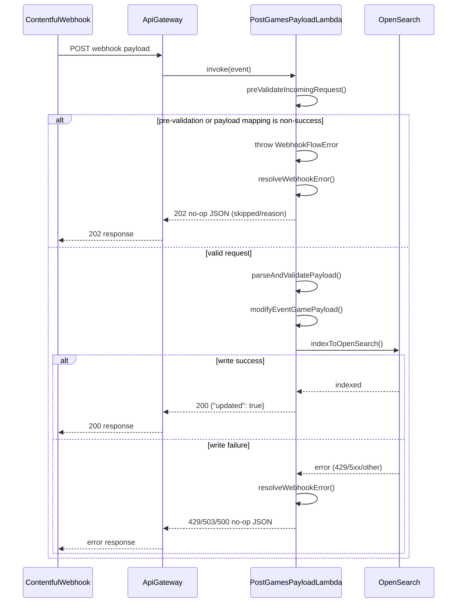

# PostGamesPayloadFunction

Processes Contentful webhook payloads for `gameV2` entries and writes normalized documents to the `games-v3` OpenSearch alias.

## Endpoint

- API path: `/sync-games-payload`
- Method: `POST`

## Sequence flow



## Request verification

The function verifies inbound webhook requests before payload processing using:

- `CONTENTFUL_WEBHOOKS_SIGNING_SECRET`
- Signed request headers from Contentful (`x-contentful-signature`, `x-contentful-signed-headers`, `x-contentful-timestamp`)

If request verification fails, the function returns `202` as a no-op.

## Current behavior

### What we return to Contentful

- All non-success paths return a no-op body with:
    - `updated: false`
    - `skipped: true`
    - `reason: <reason>`
    - optional `message` and `entryId` when relevant
- Successful indexing returns:
    - `200` with `{ "updated": true }`

### Webhook response mapping (current code)

| Condition                                                                                       | Status returned to Contentful | Response body shape                                                    | Contentful retries? |
| ----------------------------------------------------------------------------------------------- | ----------------------------- | ---------------------------------------------------------------------- | ------------------- |
| Missing request body                                                                            | `202`                         | no-op (`updated:false`, `skipped:true`, `reason:"MissingRequestBody"`) | No                  |
| Base64-encoded request body                                                                     | `202`                         | no-op (`reason:"UnsupportedBodyEncoding"`)                             | No                  |
| Failed webhook verification                                                                     | `202`                         | no-op (`reason:"UnauthorizedWebhook"`)                                 | No                  |
| Invalid JSON / invalid payload shape / unsupported payload content type                         | `202`                         | no-op (`reason:"InvalidWebhookPayload"`)                               | No                  |
| Payload transform failure (missing game payload)                                                | `202`                         | no-op (`reason:"MissingGamePayload"`)                                  | No                  |
| Incomplete autosave payload (`gamePlatformConfig`/locale fields missing)                        | `202`                         | no-op (`reason:"IncompletePlatformConfig"`, includes `entryId`)        | No                  |
| Missing runtime configuration (`CONTENTFUL_ACCESS_TOKEN`, `SPACE_ID`, `CONTENTFUL_ENVIRONMENT`) | `202`                         | no-op (`reason:"MissingRuntimeConfig"`)                                | No                  |
| OpenSearch version conflict (`409`)                                                             | `200`                         | `{ "updated": true }`                                                  | No                  |
| Successful index write                                                                          | `200`                         | `{ "updated": true }`                                                  | No                  |
| OpenSearch throttling (`429`)                                                                   | `429`                         | no-op (`reason:"OpenSearchThrottled"`)                                 | Yes                 |
| OpenSearch temporary upstream failure (`502/503/504` mapped)                                    | `503`                         | no-op (`reason:"OpenSearchTemporaryFailure"`)                          | Yes                 |
| Other OpenSearch/indexing failures                                                              | `500`                         | no-op (`reason:"ExecutionError"` or mapped error reason)               | Yes                 |

### Contentful retry behavior

- `InvalidWebhookPayload` includes missing required request fields (`id`, `contentType`, `updatedAt`, `createdAt`).
- Per Contentful webhook default retry policy:
    - retries happen for `429` and `5xx` responses
    - up to 2 additional attempts
    - approximately 30 seconds between attempts
- In this lambda, this means:
    - `202` no-op responses are non-retriable
    - `429` and `503` responses are retriable
    - `500` is also retriable by policy

### Logging

- Uses shared `os-client` logging (`logError`, `logMessage`).
- Error handling is centralized in a top-level resolver so webhook responses stay consistent across failure paths.
- Known failure paths keep explicit `ErrorCode` values to support CloudWatch alerting by code.
- Error-level logs are emitted for request validation failures, webhook verification failures, payload failures, OpenSearch failures, content-type skip in indexing, and version-conflict no-op writes.
- Skip and success logs include `entryId` for traceability in logs and dashboards.
- Incomplete autosave skip emits a warning-level error log with `errorCode=INVALID_WEBHOOK_PAYLOAD` and `statusCode=202`.
- Missing mapping field `cmsEnv` emits warning telemetry with `errorCode=MISSING_GAME_REQUIRED_FIELDS`; mapping continues with `cmsEnv` fallback `master` and does not return webhook no-op.

### CloudWatch alarm codes

Use these `ErrorCode` enum values as alarm filters:

- `MISSING_REQUEST_BODY` -> malformed webhook body
- `UNSUPPORTED_BODY_ENCODING` -> unexpected base64 payload mode
- `UNAUTHORIZED_WEBHOOK` -> signature/header verification failure
- `INVALID_WEBHOOK_PAYLOAD` -> invalid JSON/payload shape/content-type, and incomplete platform config skip
- `MISSING_GAME_PAYLOAD` -> missing `game` payload for mapping
- `MISSING_GAME_REQUIRED_FIELDS` -> warning-only mapping telemetry when `cmsEnv` is missing (fallback `master`)
- `MISSING_VERSION_TIMESTAMP` -> payload missing index version timestamp
- `OPENSEARCH_THROTTLED` -> OpenSearch `429`
- `OPENSEARCH_TEMPORARY_FAILURE` -> OpenSearch transient upstream failure (`502/503/504` mapped to `503`)
- `OPENSEARCH_INDEXING_ERROR` -> non-retryable indexing failure
- `EXECUTION_ERROR` -> runtime configuration or uncategorized execution failures

### CloudWatch metric filter setup (JSON logs)

This SAM stack sets Lambda `LogFormat: JSON` globally. For `console.error({ ... })` object logs, app fields are nested under `$.message`.

Use `$.message.error.statusCode` and `$.message.infoCode` for 200 success in metric filters:

```sh
aws logs put-metric-filter \
    --log-group-name "/aws/lambda/personalisation-lobby-games-payload-handler" \
    --filter-name "Success-200-Requests" \
    --filter-pattern '{ $.message.infoCode = "200" }' \
    --metric-transformations \
        metricName=SuccessfulRequestCount,metricNamespace=PersonalisationLobby/WebhookMetrics,metricValue=1,defaultValue=0 \
    --region eu-west-1
```

```sh
aws logs put-metric-filter \
    --log-group-name "/aws/lambda/personalisation-lobby-games-payload-handler" \
    --filter-name "Validation-202-Errors" \
    --filter-pattern '{ $.message.error.statusCode = 202 }' \
    --metric-transformations \
        metricName=ValidationErrorCount,metricNamespace=PersonalisationLobby/WebhookErrors,metricValue=1,defaultValue=0 \
    --region eu-west-1
```

```sh
aws logs put-metric-filter \
    --log-group-name "/aws/lambda/personalisation-lobby-games-payload-handler" \
    --filter-name "System-Infrastructure-Errors" \
    --filter-pattern '{ $.message.error.statusCode = 429 || $.message.error.statusCode = 503 || $.message.error.statusCode = 500 }' \
    --metric-transformations \
        metricName=SystemInfrastructureErrorCount,metricNamespace=PersonalisationLobby/WebhookErrors,metricValue=1,defaultValue=0 \
    --region eu-west-1
```

To add them to CloudWatch dashboard:

```sh
    {
        "type": "metric",
        "x": 0,
        "y": 0,
        "width": 12,
        "height": 6,
        "properties": {
            "metrics": [
                [ "PersonalisationLobby/WebhookMetrics", "SuccessfulRequestCount", { "label": "Success (200)", "color": "#2ca02c" } ],
                [ "PersonalisationLobby/WebhookErrors", "ValidationErrorCount", { "label": "Validation Errors (202)", "color": "#ff7f0e" } ],
                [ ".", "SystemInfrastructureErrorCount", { "label": "System Errors (429/503/500)", "color": "#d62728" } ]
            ],
            "period": 300,
            "stat": "Sum",
            "region": "eu-west-1",
            "title": "Webhook Handler - Status Overview",
            "view": "timeSeries",
            "stacked": false
        }
    }
```

Notes:

- Metric filters are not retroactive; they only emit for logs ingested after filter creation.
- Lambda JSON logging requires `$.message.*` paths for app log fields.
- When using dimensions in metric transformations, do not set `defaultValue` (AWS CloudWatch Logs constraint).
- This tracks error paths only. Success counts are separate and should not be inferred from this metric.

### Locale field mapping

- Locale extraction uses `getLocaleValue(value, locale, fieldName, options)` with optional:
    - `defaultValue`
    - `logOnMissing`
- If a localized value is missing and no `defaultValue` is set, the helper returns `undefined`.
- Optional fields mapped with conditional spreads are omitted from the final OpenSearch payload when `undefined`.
- For autosave-friendly optional fields (`vendor`, `nativeRequirement`, `webComponentData`, `funPanelDefaultCategory`, `funPanelBackgroundImage`), mapping sets `logOnMissing: false` to avoid noisy logs during partial updates.
- `vendor` is optional in incoming webhook payload; when missing, it is omitted from the indexed document.
- Some fields intentionally remain always present via explicit fallbacks (for example `entryTitle` defaults to `''`, `platformVisibility` defaults to `[]`).

## Local development

Build from repo root:

```sh
sam build
```

Invoke locally from repo root with one of the sample events:

```sh
sam local invoke "PostGamesPayloadFunction" -e functions/PostGamesPayloadFunction/events/event.eu.json --env-vars env.json
```
